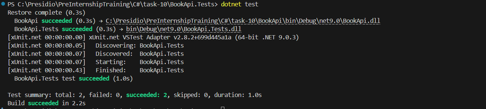
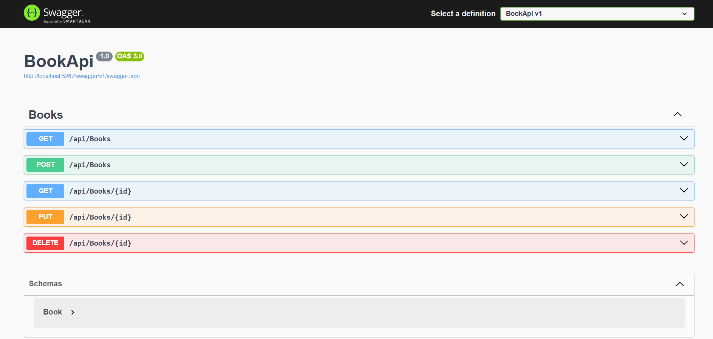
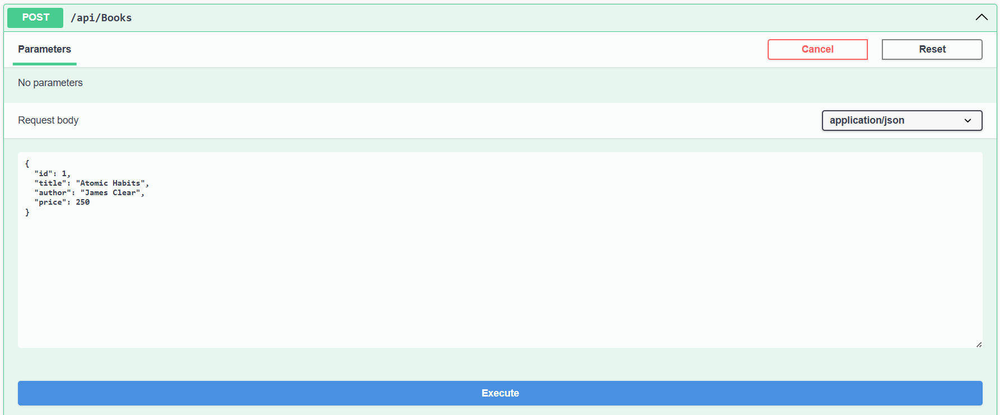
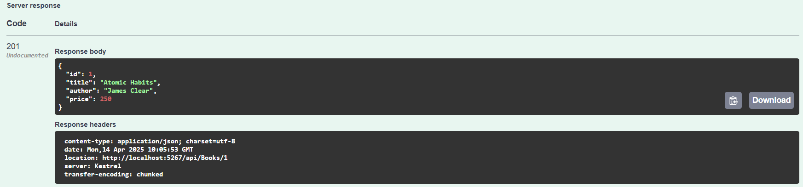
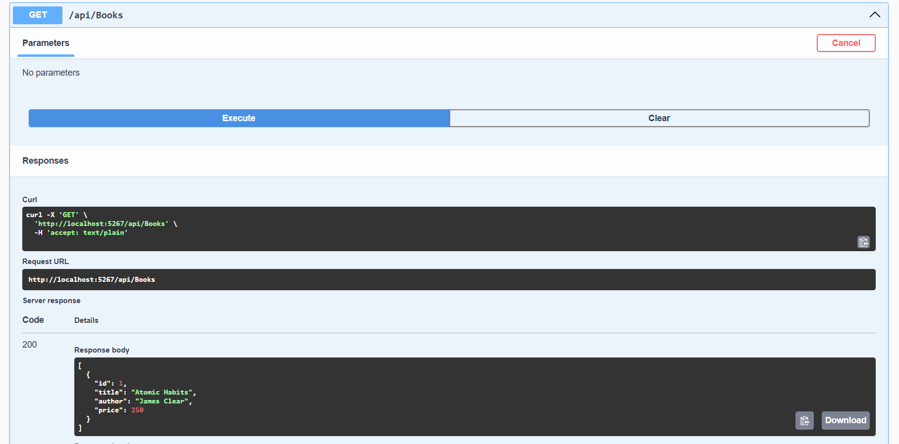
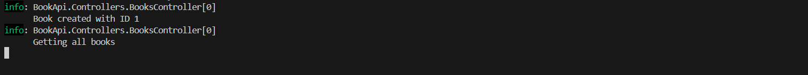

# Building a Mini Microservice with ASP.NET Core

## Requirements
- Create a small RESTful API that manages a resource (e.g., Products, Orders, or Books) using ASP.NET Core.
- Set up a new ASP.NET Core Web API project.
- Configure routing and controllers.
- Implement a service layer and register services using ASP.NET Core’s dependency injection.
- Use Entity Framework Core with an in-memory database (or SQLite) to perform CRUD operations.
- Use async/await in your controller actions to handle database operations.
- Implement middleware or filters for global exception handling.
- Integrate basic logging to record actions and errors.
- Write unit tests for your controllers and services.
- Document the API endpoints (using tools like Swagger).
- Incorporate design patterns such as Repository and Unit of Work.
- Implement custom middleware for request/response logging or authentication.

## Output
- Xunit test

- Swagger

- log

