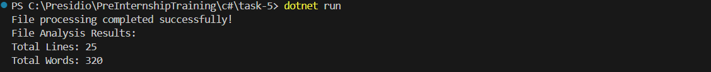
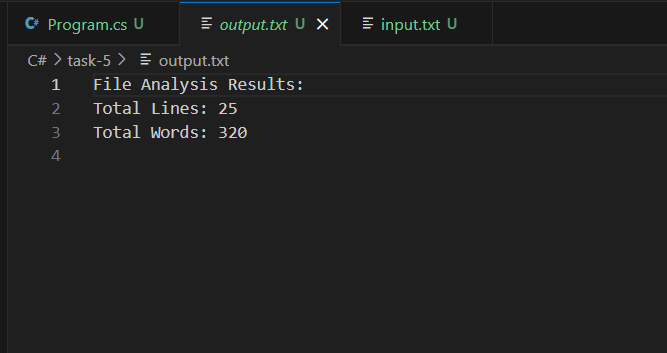

# File I/O and Exception Handling

## Requirements
- Develop an application that reads from and writes to files.
- Read text from a file (e.g., a log file or a simple CSV).
- Process the data (for example, count words or lines).
- Write the result to a new file.
- Implement exception handling to manage file-related errors (such as FileNotFoundException or IOException).

## Code

```c#
using System;
using System.IO;

namespace Task5
{
    class Program
    {
        static void Main(string[] args)
        {
            string inputFilePath = "input.txt";
            string outputFilePath = "output.txt";

            try
            {
                if (!File.Exists(inputFilePath))
                {
                    throw new FileNotFoundException($"Input file '{inputFilePath}' not found.");
                }

                string fileContent = File.ReadAllText(inputFilePath);
                int lineCount = CountLines(fileContent);
                int wordCount = CountWords(fileContent);

                string result = $"File Analysis Results:\n" +
                              $"Total Lines: {lineCount}\n" +
                              $"Total Words: {wordCount}\n";

                
                File.WriteAllText(outputFilePath, result);

                Console.WriteLine("File processing completed successfully!");
                Console.WriteLine(result);
            }
            catch (FileNotFoundException ex)
            {
                Console.WriteLine($"Error: {ex.Message}");
            }
            catch (Exception ex)
            {
                Console.WriteLine($"Unexpected error: {ex.Message}");
            }
        }

        static int CountLines(string content)
        {
            if (string.IsNullOrEmpty(content))
                return 0;

            string[] lines = content.Split(new[] { '\n', '\r' }, StringSplitOptions.RemoveEmptyEntries);
            return lines.Length;
        }

        static int CountWords(string content)
        {
            if (string.IsNullOrEmpty(content))
                return 0;

            string[] words = content.Split(new[] { ' ', '\t', '\n', '\r' }, StringSplitOptions.RemoveEmptyEntries);
            return words.Length;
        }
    }
}
```

## Console Output


