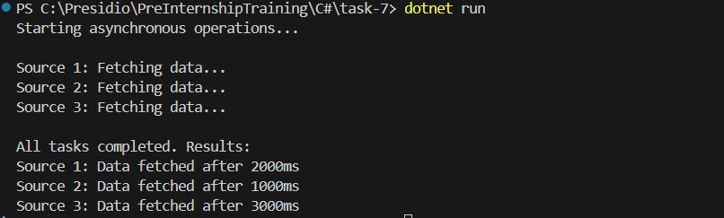
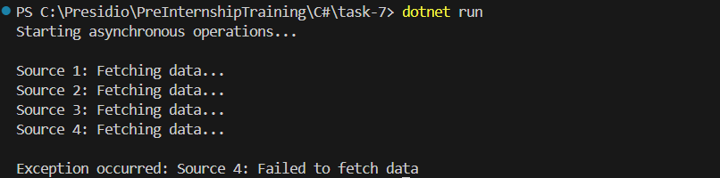

# Asynchronous Programming and Multi-threading

## Requirements
- Develop a console application that performs multiple asynchronous operations concurrently.
- Use async and await to fetch data from multiple simulated sources (e.g., using Task.Delay to mimic API calls).
- Aggregate the results once all tasks are complete.
- Handle exceptions that may occur during asynchronous operations.

## Code

```c#
using System;
using System.Collections.Generic;
using System.Linq;
using System.Threading.Tasks;

namespace AsyncProgrammingDemo
{
    class Program
    {
        static async Task Main(string[] args)
        {
            Console.WriteLine("Starting asynchronous operations...\n");

            try
            {
                
                List<Task<string>> tasks = new List<Task<string>>
                {
                    FetchDataFromSource("Source 1", 2000),
                    FetchDataFromSource("Source 2", 1000),
                    FetchDataFromSource("Source 3", 3000),
                    FetchDataFromSourceWithError("Source 4", 1500)
                };

                
                var results = await Task.WhenAll(tasks);

                
                Console.WriteLine("\nAll tasks completed. Results:");
                foreach (var result in results)
                {
                    Console.WriteLine(result);
                }
            }
            catch (Exception ex)
            {
                Console.WriteLine($"\nException occurred: {ex.Message}");
            }
        }

        static async Task<string> FetchDataFromSource(string sourceName, int delay)
        {
            Console.WriteLine($"{sourceName}: Fetching data...");
            await Task.Delay(delay); 
            return $"{sourceName}: Data fetched after {delay}ms";
        }

        static async Task<string> FetchDataFromSourceWithError(string sourceName, int delay)
        {
            Console.WriteLine($"{sourceName}: Fetching data...");
            await Task.Delay(delay); 
            throw new InvalidOperationException($"{sourceName}: Failed to fetch data");
        }
    }
}
```

## Console Output
- without error

- with error
