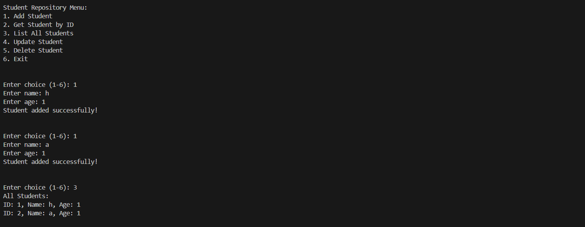
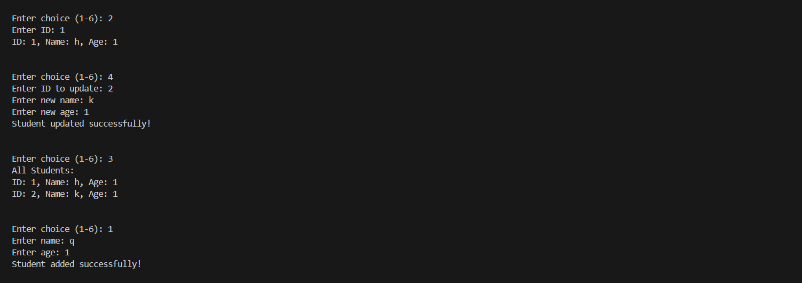
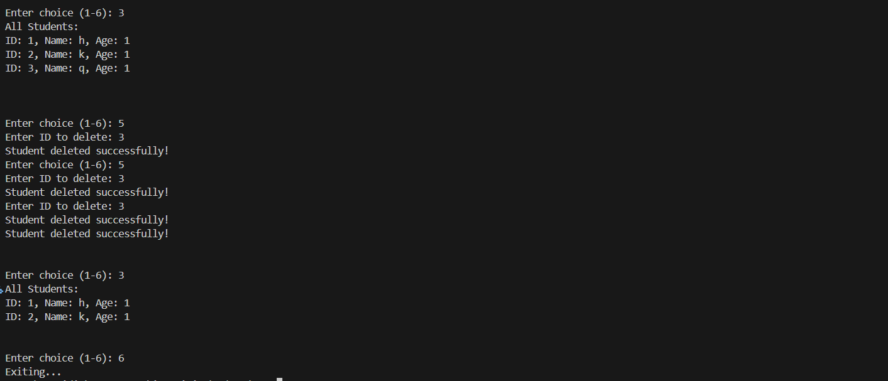

# Generics and Interfaces with a Repository Pattern

## Requirements
- Implement a generic in-memory repository to perform CRUD operations.
- Define an interface (e.g., IRepository<T>) with methods like Add, Get, Update, and Delete.
- Create a generic class that implements this interface.
- Use type constraints if necessary (e.g., where T : class or implementing a specific interface).
- Write a simple console UI to demonstrate the repository with a sample entity (e.g., Product or Student).

## Code
Interface
```c#
public interface IRepository<T> where T : class
{
    void Add(T item);
    T Get(int id);
    IEnumerable<T> GetAll();
    void Update(int id, T item);
    void Delete(int id);
}
```

Repository

```c#
public class InMemoryRepository<T> : IRepository<T> where T : class
{
    private readonly Dictionary<int, T> _items = new Dictionary<int, T>();
    private int _nextId = 1;

    public void Add(T item)
    {
        if (item == null)
            throw new ArgumentNullException();

        if (item is Student student)
        {
            student.Id = _nextId;
            _nextId++;
            _items[student.Id] = item;
        }
    }

    public T Get(int id)
    {
        _items.TryGetValue(id, out T item);
        return item;
    }

    public IEnumerable<T> GetAll()
    {
        return _items.Values;
    }

    public void Update(int id, T item)
    {
        if (item == null)
            throw new ArgumentNullException(nameof(item));

        if (!_items.ContainsKey(id))
            throw new ArgumentException($"Item with ID {id} not found");

        _items[id] = item;

        if (item is Student student)
            student.Id = id;
    }

    public void Delete(int id)
    {
        if (!_items.Remove(id))
            throw new ArgumentException($"Item with ID {id} not found");
    }
}

```

Student Class

```c#
public class Student
{
    public int Id { get; set; }
    public string Name { get; set; }
    public int Age { get; set; }

    public Student(int id, string name, int age)
    {
        Id = id;
        Name = name ?? throw new ArgumentNullException();
        Age = age;
    }

    public override string ToString()
    {
        return $"ID: {Id}, Name: {Name}, Age: {Age}";
    }
}
```

Main function

```c#
class Program
{
    static void Main(string[] args)
    {

        IRepository<Student> studentRepo = new InMemoryRepository<Student>();

        try
        {
            Console.WriteLine("\nStudent Repository Menu:");
            Console.WriteLine("1. Add Student");
            Console.WriteLine("2. Get Student by ID");
            Console.WriteLine("3. List All Students");
            Console.WriteLine("4. Update Student");
            Console.WriteLine("5. Delete Student");
            Console.WriteLine("6. Exit");

            while (true)
            {
                Console.Write("\n\nEnter choice (1-6): ");

                string choice = Console.ReadLine();

                switch (choice)
                {
                    case "1":
                        Console.Write("Enter name: ");
                        string name = Console.ReadLine();
                        Console.Write("Enter age: ");
                        int age = int.Parse(Console.ReadLine() ?? "0");
                        studentRepo.Add(new Student(0, name, age));
                        Console.WriteLine("Student added successfully!");
                        break;

                    case "2":
                        Console.Write("Enter ID: ");
                        int getId = int.Parse(Console.ReadLine() ?? "0");
                        Student student = studentRepo.Get(getId);
                        Console.WriteLine(student != null ? student.ToString() : "Student not found");
                        break;

                    case "3":
                        var students = studentRepo.GetAll();
                        Console.WriteLine("All Students:");
                        foreach (var s in students)
                        {
                            Console.WriteLine(s);
                        }
                        break;

                    case "4":
                        Console.Write("Enter ID to update: ");
                        int updateId = int.Parse(Console.ReadLine() ?? "0");
                        Console.Write("Enter new name: ");
                        string newName = Console.ReadLine();
                        Console.Write("Enter new age: ");
                        int newAge = int.Parse(Console.ReadLine() ?? "0");
                        studentRepo.Update(updateId, new Student(updateId, newName, newAge));
                        Console.WriteLine("Student updated successfully!");
                        break;

                    case "5":
                        Console.Write("Enter ID to delete: ");
                        int deleteId = int.Parse(Console.ReadLine() ?? "0");
                        studentRepo.Delete(deleteId);
                        Console.WriteLine("Student deleted successfully!");
                        break;

                    case "6":
                        Console.WriteLine("Exiting...");
                        return;

                    default:
                        Console.WriteLine("Invalid choice. Try again.");
                        break;
                }
            }
        }
        catch (Exception ex)
        {
            Console.WriteLine($"Error: {ex.Message}");
        }
    }
}
```

## Console Output


