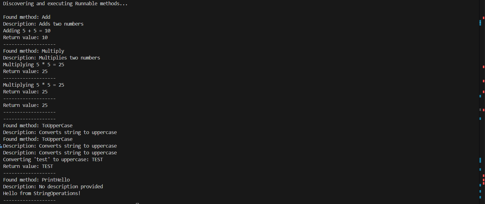

# Reflection and Custom Attributes

## Requirements
- Build an application that discovers and executes methods based on custom attributes.
- Define a custom attribute (e.g., [Runnable]).
- Create several classes with methods decorated with the [Runnable] attribute.
- Use reflection to scan the current assembly for methods marked with [Runnable].
- Invoke the discovered methods dynamically and display their outputs.

## Code
Custom Runnable Attribute
```c#
[AttributeUsage(AttributeTargets.Method, AllowMultiple = false)]
public class RunnableAttribute : Attribute
{
    public string Description { get; }

    public RunnableAttribute(string description = "No description provided")
    {
        Description = description;
    }
}
```

Classes with Runnable attributed methods

```c#
public class MathOperations
{
    [Runnable("Adds two numbers")]
    public int Add(int a, int b)
    {
        int result = a + b;
        Console.WriteLine($"Adding {a} + {b} = {result}");
        return result;
    }

    [Runnable("Multiplies two numbers")]
    public int Multiply(int x, int y)
    {
        int result = x * y;
        Console.WriteLine($"Multiplying {x} * {y} = {result}");
        return result;
    }


    public void DoNothing()
    {
        Console.WriteLine("This won't run");
    }
}


public class StringOperations
{
    [Runnable("Converts string to uppercase")]
    public string ToUpperCase(string input)
    {
        string result = input.ToUpper();
        Console.WriteLine($"Converting '{input}' to uppercase: {result}");
        return result;
    }

    [Runnable]
    public void PrintHello()
    {
        Console.WriteLine("Hello from StringOperations!");
    }
}

```

Main function

```c#
class Program
{
    static void Main(string[] args)
    {
        try
        {

            Assembly assembly = Assembly.GetExecutingAssembly();

            
            var types = assembly.GetTypes();

            Console.WriteLine("Discovering and executing Runnable methods...\n");

            foreach (var type in types)
            {
                
                if (type == typeof(RunnableAttribute) || type == typeof(Program))
                    continue;

                
                object instance = Activator.CreateInstance(type);

                
                var methods = type.GetMethods()
                    .Where(m => m.GetCustomAttributes(typeof(RunnableAttribute), false).Length > 0);

                foreach (var method in methods)
                {
                    
                    var attribute = (RunnableAttribute)method.GetCustomAttributes(typeof(RunnableAttribute), false)[0];
                    Console.WriteLine($"Found method: {method.Name}");
                    Console.WriteLine($"Description: {attribute.Description}");

                    try
                    {
                        
                        object[] parameters = GetSampleParameters(method);

                        object result = method.Invoke(instance, parameters);

                        
                        if (method.ReturnType != typeof(void))
                        {
                            Console.WriteLine($"Return value: {result}");
                        }
                    }
                    catch (Exception ex)
                    {
                        Console.WriteLine($"Error executing {method.Name}: {ex.Message}");
                    }

                    Console.WriteLine("-------------------");
                }
            }
        }
        catch (Exception ex)
        {
            Console.WriteLine($"Unexpected error: {ex.Message}");
        }
    }

    static object[] GetSampleParameters(MethodInfo method)
    {
        var parameters = method.GetParameters();
        object[] args = new object[parameters.Length];

        for (int i = 0; i < parameters.Length; i++)
        {
            var paramType = parameters[i].ParameterType;
            if (paramType == typeof(int))
                args[i] = 5; 
            else if (paramType == typeof(string))
                args[i] = "test"; 
            else
                args[i] = null; 
        }

        return args;
    }
}
```

## Console Output
